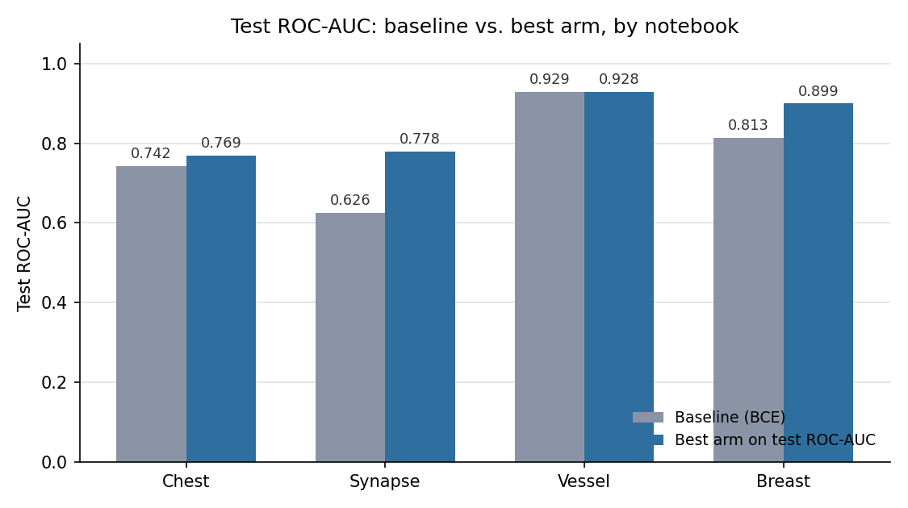

# Deep AUC maximization on MedMNIST

This repo compares LibAUC's AUC-maximization losses with standard cross-entropy training on MedMNIST classification tasks. It started as a machine learning course project at Texas A&M (CSE633, Spring 2023). Four of the notebooks were later reworked with a clearer baseline, more metrics and saved outputs.

## Main notebooks

| Dataset | Task | Compared | Headline result (test ROC-AUC) | Notebook |
|---|---|---|---|---|
| ChestMNIST | 14 findings, multi-label, 28x28 X-rays | BCE baseline, pos_weight BCE, Focal Loss, LibAUC AUC-margin loss | pos_weight BCE 0.769, Baseline 0.742, Focal Loss 0.726, AUC-margin 0.633 (macro) | [chestMNIST.ipynb](chestMNIST.ipynb) |
| SynapseMNIST3D | inhibitory vs. excitatory synapse, 28x28x28 volumes | BCE baseline, four LibAUC augmentation sets, 3D convolution, Optuna | Baseline 0.626, tuned Conv3d 0.778 | [SynapseMNIST.ipynb](SynapseMNIST.ipynb) |
| VesselMNIST3D | aneurysm vs. healthy, 28x28x28 volumes | BCE baseline, LibAUC with and without balancing, 3D convolution, Optuna | Baseline 0.929, hand-picked LibAUC Conv3d 0.928 (tuned arm not recorded) | [VesselDataset.ipynb](VesselDataset.ipynb) |
| BreastMNIST | malignant vs. normal/benign ultrasound, 28x28 | BCE baseline, four LibAUC augmentation sets, Optuna | Baseline 0.813, tuned 0.876, best hand-picked 0.899 | [BreastDataset.ipynb](BreastDataset.ipynb) |

Chest is the only one with bootstrap intervals and per-label thresholds tuned on validation. Synapse and Vessel also compare 2.5D ResNets (depth slices as channels) with a 3D convolutional network. Breast is the smallest, with 156 test images.

ROC-AUC alone does not show whether a gain reaches the minority class, which is the point of using these losses. The table below adds PR-AUC, balanced accuracy, MCC and minority recall/F1 for the baseline and each notebook's best arm with full metrics recorded.

Minority/positive class: malignant (Breast), aneurysm (Vessel), inhibitory (Synapse). Chest has no single minority class, its metrics are macro-averaged over all 14 findings instead. PR-AUC is for the minority class only in Vessel. In Breast and Synapse it is for the majority class, so it says little about the minority there, recall and F1 are the better read for those two.

| Dataset | Arm | Test ROC-AUC | PR-AUC | Bal. acc. @0.5 | MCC @0.5 | Recall @0.5 | F1 @0.5 |
|---|---|---|---|---|---|---|---|
| Chest | Baseline | 0.742 | 0.141 | 0.507 | 0.035 | - | 0.026 |
| Chest | pos_weight BCE (best) | 0.769 | 0.157 | 0.585 | 0.154 | - | 0.185 |
| Synapse | Baseline | 0.626 | 0.807 | 0.578 | 0.141 | 0.526 | 0.417 |
| Synapse | Optuna-tuned Conv3d (best) | 0.778 | 0.897 | 0.644 | 0.334 | 0.390 | 0.468 |
| Vessel | Baseline | 0.929 | 0.710 | 0.792 | 0.590 | 0.628 | 0.635 |
| Vessel | Optuna-tuned (best) | not recorded | 0.756 | 0.824 | 0.623 | 0.698 | 0.667 |
| Breast | Baseline | 0.813 | 0.887 | 0.649 | 0.414 | 0.333 | 0.467 |
| Breast | Optuna-tuned (best) | 0.876 | 0.937 | 0.841 | 0.630 | 0.857 | 0.735 |

Chest's recall and F1 are macro over 14 labels. Recall and F1 for the other three are for the minority class. The "best" arm here is the one with full metrics recorded, not always the single highest ROC-AUC (Breast's Model 1 and Vessel's hand-picked Conv3d score higher on ROC-AUC alone but were not evaluated on the other metrics).



## What the experiments show

- Chest: pos_weight BCE has the best test ROC-AUC (0.769) and is also best on PR-AUC, balanced accuracy, MCC and F1, so the gain is not just an AUC artifact. The AUC-margin arm (Hand-picked) is last on ROC-AUC and PR-AUC, but it is second on the 0.5-threshold metrics, ahead of the plain Baseline and Focal Loss. Its hyperparameters were not tuned and its optimizer differs too.
- Synapse: the Optuna-tuned Conv3d has the best ROC-AUC (0.778) and also wins balanced accuracy and MCC, but PR-AUC here is for the majority (excitatory) class. On inhibitory recall, the more informative number, the untuned baseline is higher (0.526 vs. 0.390), so the metrics disagree.
- Vessel: the BCE baseline ties the hand-picked Conv3d on ROC-AUC (0.929 vs. 0.928), so the AUC-margin recipe shows no ROC-AUC gain here. The Optuna-tuned Conv3d has no recorded test ROC-AUC, but it beats the baseline on PR-AUC (aneurysm, the minority class here), balanced accuracy, MCC and aneurysm recall/F1.
- Breast: hand-picked augmentation models beat the baseline on ROC-AUC, and Model 1 is the highest of any arm (0.899), but it has no other metrics recorded. Of the two arms with full metrics, Optuna-tuned beats the baseline on ROC-AUC, PR-AUC, balanced accuracy, MCC and malignant recall/F1, so that gain is not just an AUC artifact.

The arms in every notebook differ in stem, loss, optimizer, sampler and augmentation, not just the loss function, and hyperparameters were not tuned for every arm. Test sets are small, so differences of a few hundredths may be noise.

## How the experiments are set up

- A BCE baseline (ResNet-18, Adam, no augmentation) in every notebook.
- A hand-picked LibAUC recipe with fixed hyperparameters: `PESG` with `AUCMLoss_V2` and `DualSampler` for the binary tasks, `MultiLabelAUCMLoss` for chest.
- A 30-trial Optuna search on the hand-picked recipe in Breast, Synapse and Vessel. Chest has no search but adds pos_weight BCE and Focal Loss.
- Up to 50 epochs, with the best-validation checkpoint restored.
- Several metrics (ROC-AUC, PR-AUC, balanced accuracy, MCC, F1 or recall) and no single winner. Only some arms have every metric, and each Results section says which.

Training and evaluation helpers, and the Optuna helpers, are shared code (see below).

## Earlier notebooks

[PneumoniaDataset.ipynb](PneumoniaDataset.ipynb), [noduleDataset.ipynb](noduleDataset.ipynb) and [AdrenalDataset.ipynb](AdrenalDataset.ipynb) are earlier coursework that was not revisited.

## Repo contents

- `chestMNIST.ipynb`, `SynapseMNIST.ipynb`, `VesselDataset.ipynb`, `BreastDataset.ipynb`: the four main notebooks.
- `PneumoniaDataset.ipynb`, `noduleDataset.ipynb`, `AdrenalDataset.ipynb`: earlier coursework.
- `dataCentric_functions.py`: training loops (`train`, `multilabel_train`, `train_with_logits_loss`), a weighted sampler, on-the-fly augmentation, Gaussian noise and a validation AUC helper.
- `hyperparameter_tuning.py`: Optuna search and retrain helpers shared by the Breast, Synapse and Vessel notebooks.
- `pyproject.toml`: dependencies, split into two extras.

## Setup

The notebooks were written and run on Google Colab with a GPU (an L4 in the saved outputs). To run them locally, use [uv](https://docs.astral.sh/uv/). The four notebooks need two different LibAUC versions, which cannot share one environment, so there are two extras:

- `binary` (libauc 1.2.0, MONAI, Optuna) for `BreastDataset.ipynb`, `SynapseMNIST.ipynb` and `VesselDataset.ipynb`.
- `chest` (libauc 2.0.1 or later) for `chestMNIST.ipynb`, which needs `MultiLabelAUCMLoss`. libauc 1.2.0 does not have it.

```
uv sync --extra binary      # or: uv sync --extra chest
uv run --extra binary jupyter lab
```

Open the notebook from the repo root, so `dataCentric_functions.py` can be imported. Skip the `!pip install` cells, since uv already installed the packages.

The chest, Synapse and Vessel notebooks also have a cell that downloads the dataset with `wget` into `/root/.medmnist`, which is a Colab path. Skip that cell locally. The dataset cell calls `DataClass(..., download=True)`, and medmnist then downloads the file into `~/.medmnist` by itself. The notebooks fall back to CPU without CUDA, but that has not been tried and training would be slow.

## References

- Yang et al., MedMNIST v2: a large-scale lightweight benchmark for 2D and 3D biomedical image classification, Scientific Data 10, 41 (2023). https://doi.org/10.1038/s41597-022-01721-8
- Yuan et al., LibAUC: A Deep Learning Library for X-Risk Optimization, 29th SIGKDD Conference on Knowledge Discovery and Data Mining (2023).

## License

This repository's own code (notebooks and the two `.py` helper modules) is under the MIT license, see [LICENSE](LICENSE). LibAUC is a separate dependency with its own license: version 1.2.0, used by the `binary` extra, is GPLv3, and version 2.0.1+, used by the `chest` extra, is MIT. Neither is bundled here, uv installs them from PyPI.
